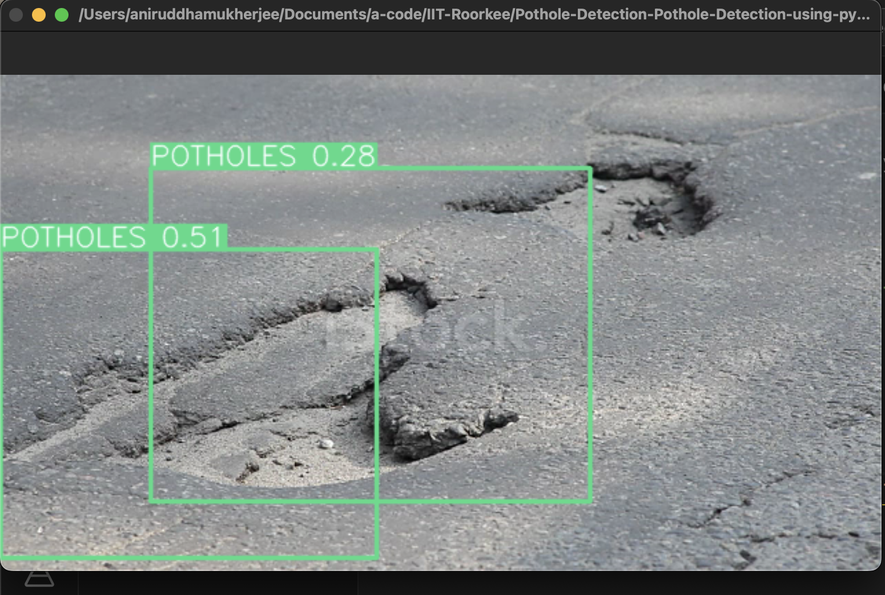
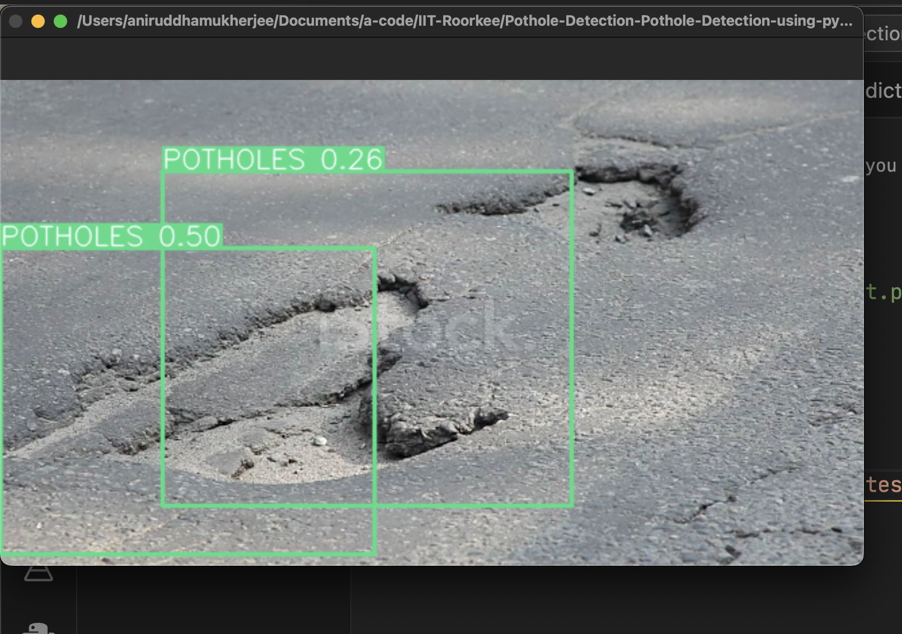
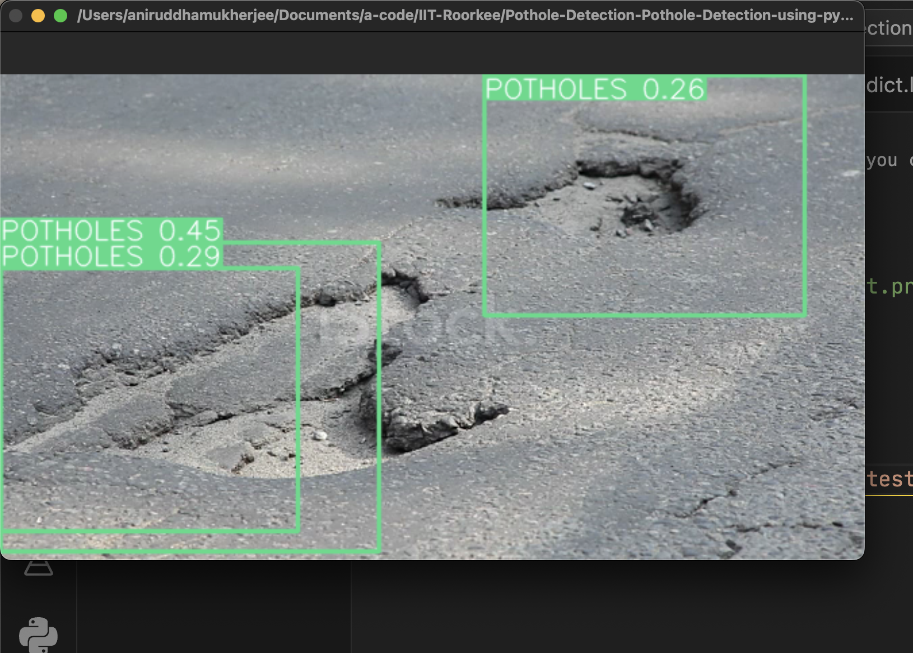

# Pothole Detection 


### Dataset Used

Pothole images dataset by COCO. The COCO dataset primarily includes images with object annotations across 80 object categories, such as people, cars, and animals. Using this dataset, potholes in city streets might be automatically identified and categorised, allowing for quicker repair of the worst ones.  

---

### Model Details

We have used "YOLOv8" for our project which was officially released on 10th January, 2023 and offers higer accuracy and faster speed compared to the older versions. For instance, the YOLOv8(medium) has a 50.2 mAP score at 1.83 milliseconds on the COCO dataset and A100 TensorRT. YOLO v8 also features a Python package and CLI-based implementation, making it easy to use and develop. 
YOLOv8 comes in five variants based on the number of parameters – nano(n), small(s), medium(m), large(l), and extra large(x). We can use all the variants for classification, object detection, and segmentation.  

---

### Problem Statement

As the model is known to support object detection, instance segmentation, and image classification, it helps in the detection of potholes and give users a heads up as to what is coming next. They can either avoid it and take a new route or adjust their speed accordingly which will help in reducing accidents and maintaining road safety.

---

### Model Pros

Improved accuracy: YOLOv8 delivers state-of-the-art results on a range of object identification benchmarks. It outperforms prior versions of YOLO, particularly for tiny and difficult-to-detect objects.

Quicker speed: YOLOv8 is quicker than earlier versions of YOLO while remaining more accurate. This is the result of several optimisations, including a new backbone network based on EfficientNet.

Improved developer experience: YOLOv8 has several improvements that make it easier to use and customise than prior versions of YOLO. For example, it has a new API that simplifies model training and deployment.

---

## Steps to run Code
1. Clone the repository.
```
git clone https://github.com/annimukherjee/Road-Safety-ModelZoo/tree/main
```

2. Goto the cloned folder.
```
cd 1_Pothole-Detection
```

3. Upgrade pip with the mentioned command below.
```
pip install --upgrade pip
```

4. Create a virual env and activate it:

```
conda create -n pothole-env python=3.8
conda activate pothole-env
```

5. Install requirements with the mentioned command below.

```
pip install -r reqs.txt
```

6. Run the code with the mentioned command below.

 - Run for webcam: `python test.py`


---

> can run the below commands as well, however it's optional:

    `python predict.py model=y8best.pt source="demo.mp4" show=True`

    `python predict.py model=y8best.pt source=0 show=True`


download weight `y8best.pt`: https://drive.google.com/drive/folders/1T1h2WH3_wrNb0foJuDw8w33Br_2kZjnS?usp=share_link


<br>

## ⁠Results

**Video Demo**

[https://github.com/annimukherjee/Road-Safety-ModelZoo/assets/85307430/e21f500a-db8b-464c-ab8c-d0643d109252](https://github.com/annimukherjee/Road-Safety-ModelZoo/assets/85307430/e21f500a-db8b-464c-ab8c-d0643d109252)

<p align="center">
  
</p>
<p align="center">
  
</p>
<p align="center">
  
</p>


