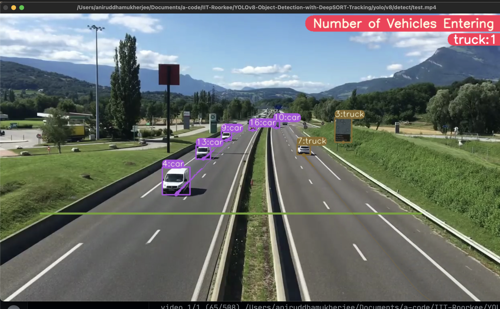
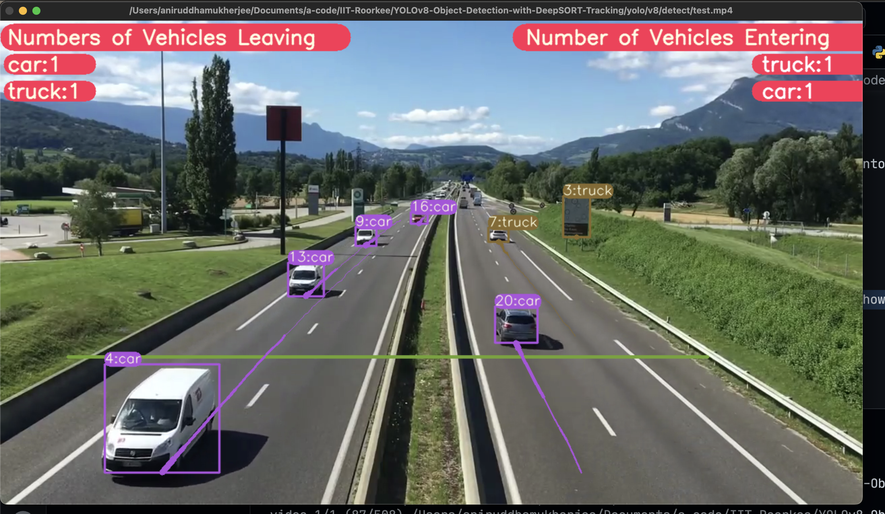
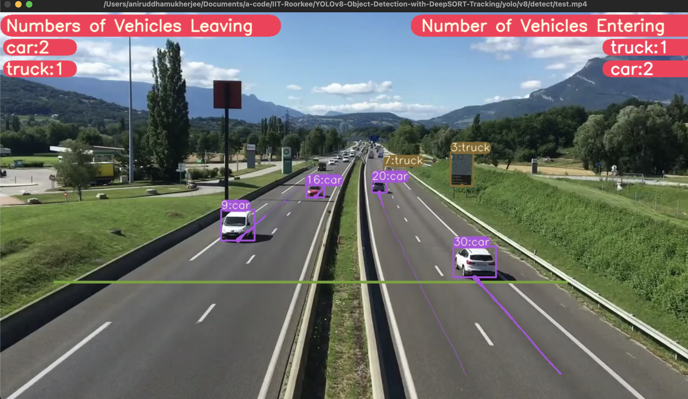
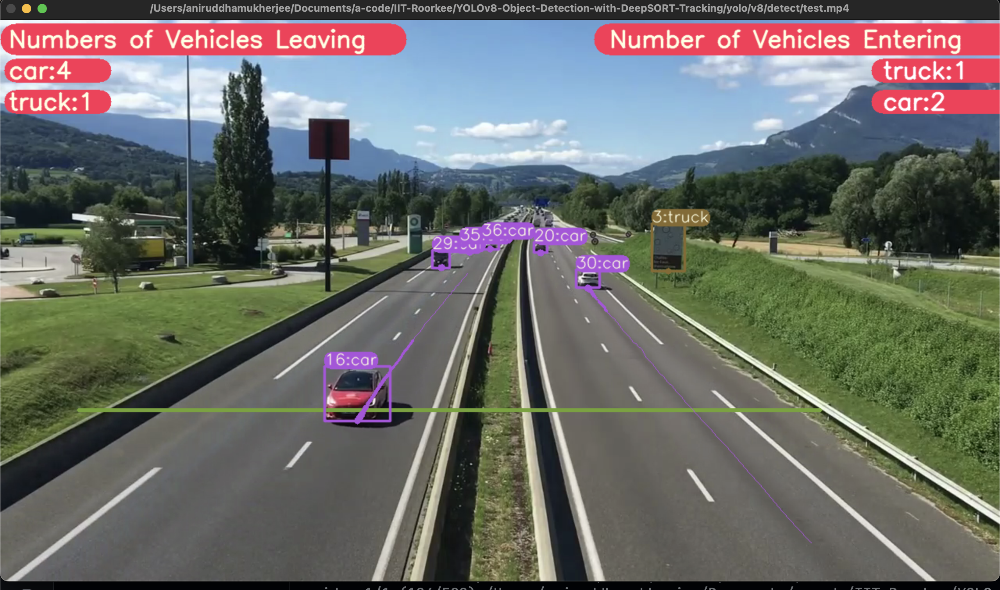

# YOLOv8-with-DeepSORT-Tracking-Number-Of-Cars-InOut

## Features

- **YOLOv8 Object Detection with DeepSORT Tracking (ID + Trails):** Utilises the latest advancements in object detection and tracking to ensure accurate and efficient performance.

## Dataset Used

- **Dataset Information:**
  - Name of Dataset: _[Name of the dataset]_
  - Dataset Statistics: Contains _[number of images]_ images, widely recognised for its diversity and complexity.
  - Usage: This dataset is widely used in advanced object detection research and applications due to its comprehensive collection of real-world images.

## Model Details

- **Model Used:** YOLO-V8
  - Technical Details: 
    - Architecture: _[Provide details about the architecture]_
    - Efficiency: _[Discuss aspects like model size, speed, etc.]_
    - Accuracy: _[Provide details on accuracy metrics, if available]_

## Problem Statement

- **Purpose and Impact:**
  - The model is designed to detect potholes effectively, addressing a crucial road safety issue.
  - Its application extends to improving road conditions, thereby benefiting public safety and vehicle maintenance.

## Model Pros

- **Advantages of Selected Model:**
  - _[Highlight why YOLOv8 was chosen, focusing on aspects like its state-of-the-art accuracy, low inference time, and other benefits]_


## Steps to run Code

-   Clone the repository

```
git clone https://github.com/annimukherjee/Road-Safety-ModelZoo/tree/main
```

-   Goto cloned folder

```
cd 2_DeepSORT-Tracking-Number-Of-Cars-InOut
```

-   Install the ultralytics package

```
pip install ultralytics==8.0.0
```

-   Setting the Directory.

```
cd yolo/v8/detect
```

-   Do Tracking

```
# video file
python tracking_vehicle_counting.py model=yolov8l.pt source="test.mp4" show=True
```

## Results


<br>


## ⁠Results

**Video Demo**

https://github.com/annimukherjee/Road-Safety-ModelZoo/assets/85307430/f7ba3b0f-39b6-4ced-9300-8c975b02643a

<p align="center">
  
</p>
<p align="center">
  
</p>
<p align="center">
  
</p>
<p align="center">
  
</p>


