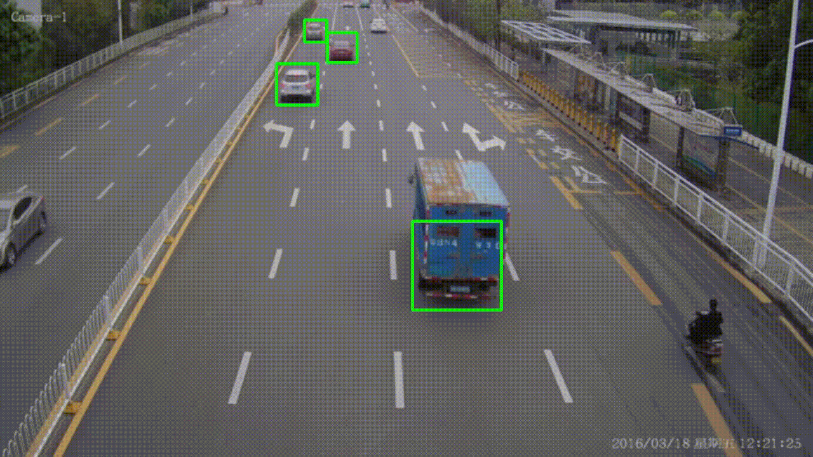

# Vehicle Speed Detection

Technologies used :

-   Python
-   opencv
-   dlib
     

Tasks breakdown

1. Vehicle Detection
    - We are using Haarcascade classifier to identify vehicles.
2. Vehicle Tracking - ( assigning IDs to vehicles )
    - We have used corelation tracker from dlib library.
3. Speed Calculation
    - We are calculating the distance moved by the tracked vehicle
      in a second, in terms of pixels, so we need pixel per meter
      to calculate the distance travelled in meters.
    - With distance travelled per second in meters, we will get the
      speed of the vehicle.

### Features

YOLOv8 Object Detection with DeepSORT Tracking(ID + Trails)

### Dataset Used

> ⁠which dataset -> stats of the dataset, how many images etc. and that it’s widely used…

### Model Details

We have used "YOLOv8" for our project which was officially released on 10th January, 2023 and offers higer accuracy and faster speed compared to the older versions. For instance, the YOLOv8(medium) has a 50.2 mAP score at 1.83 milliseconds on the COCO dataset and A100 TensorRT. YOLO v8 also features a Python package and CLI-based implementation, making it easy to use and develop. YOLOv8 comes in five variants based on the number of parameters – nano(n), small(s), medium(m), large(l), and extra large(x). We can use all the variants for classification, object detection, and segmentation.

### Problem Statement

The model facilitates real-time vehicle speed detection, instantly alerting authorities to instances of over-speeding or violations of speed limits. This proactive system serves as a crucial preventive measure against daily occurrences of vehicle collisions attributed to high speeds, promoting road safety and averting potential accidents.

### Model Pros

Improved accuracy: YOLOv8 delivers state-of-the-art results on a range of object identification benchmarks. It outperforms prior versions of YOLO, particularly for tiny and difficult-to-detect objects.

Quicker speed: YOLOv8 is quicker than earlier versions of YOLO while remaining more accurate. This is the result of several optimisations, including a new backbone network based on EfficientNet.

Improved developer experience: YOLOv8 has several improvements that make it easier to use and customise than prior versions of YOLO. For example, it has a new API that simplifies model training and deployment.

## How to run project?

Follow steps:

1. Clone repo :
   `git clone ...`

2. cd (change directory) into vehicle-speed-check
   `cd 3_Vehicle-Speed-Check-Estimator`

3. Create virtual environment
   `conda create -n speed-estimator python=3.8`

4. Activate virtual environment
   `conda activate speed-estimator`

5. Install requirements
   `pip install dlib`
   `pip install opencv-python`

6. run speed_check.py script
   `python speed_check.py`

#### Note:

##### Estimating Pixels Per Metre (PPM)

The estimation of Pixels Per Metre (PPM) is a crucial step for speed calculation in our project. This process is manually performed for each specific road, as PPM values can vary significantly from one road to another. Therefore, when applying this method to different videos, adjustments to the PPM value are necessary.

##### How PPM is Estimated

The estimation involves two key measurements:

1. **Actual Road Width in Metres**: This is obtained through online resources, such as Google, to find an approximate width of the road in your country.
2. **Road Width in Pixels**: By analyzing a frame from our video footage, we determine the width of the road in pixels.

With these two measurements, we map real-world distances to those in our video frame. Pixels Per Metre (PPM) is then calculated by dividing the road width in pixels by its width in metres.

##### Calculating Speed

To estimate the speed of a vehicle, we follow these steps:

1. **Determine Pixel Distance (d_pixels)**: This represents the distance travelled by the vehicle in one frame of our video.
2. **Convert d_pixels to Metres (d_metres)**: Using our PPM value, we convert the pixel distance to metres.
3. **Calculate Speed**: The formula used is `speed = d_metres * fps * 3.6`. Here, `d_metres` is the distance travelled in one frame, and `fps` is the average frames per second obtained during video processing. The speed is initially calculated in metres per second (m/s) and then converted to kilometres per hour (km/hr) by multiplying with 3.6.
